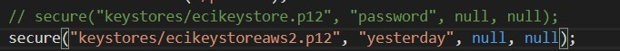
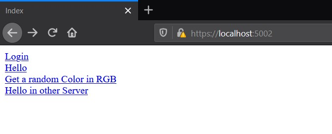
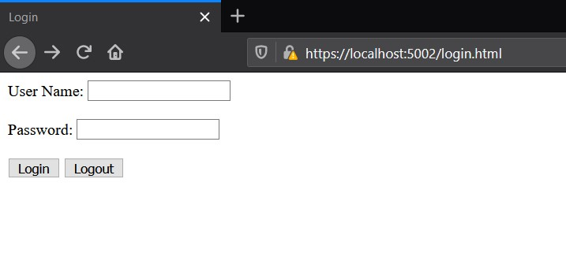
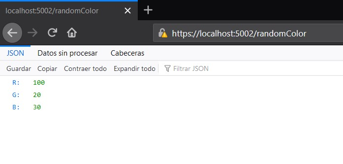

# AREP - Laboratorio #6
La aplicación consiste en dos servidores, ambos servidores cuentan con un certificado con el fin de implementar la seguridad en aplicaciones web. Un servidor se encarga de realizar la autenticación de los usuarios y mantenerla para que puedan acceder a los servicios, sin autenticarse no se podrá acceder a ningún servicio.
El otro servidor realiza una función básica, en este caso es devolver un color aleatorio en código RGB.

El cliente solo se comunica con el servidor que tiene sistema de login y este, de manera segura, se conectara con el otro para consultar sus servicios y ofrecérselos al cliente si esta autenticado.

Los servidores se comunican de manera segura a través de protocolos de seguridad como SSL, TSL y HTTPS.

Al final se encuentra una demostración en video con los servidores ejecutándose en instancias EC2 de AWS (Amazon Web Services).

## Conceptos

### SSL
SSL es el acrónimo de Secure Sockets Layer (capa de sockets seguros), la tecnología estándar para mantener segura una conexión a Internet, así como para proteger cualquier información confidencial que se envía entre dos sistemas e impedir que los delincuentes lean y modifiquen cualquier dato que se transfiera, incluida información que pudiera considerarse personal.

### TSL 
El protocolo TLS (Transport Layer Security, seguridad de la capa de transporte) es solo una versión actualizada y más segura de SSL.

### HTTPS
HTTPS (Hyper Text Transfer Protocol Secure o protocolo seguro de transferencia de hipertexto) aparece en la dirección URL cuando un sitio web está protegido por un certificado SSL. Los detalles del certificado, por ejemplo la entidad emisora y el nombre corporativo del propietario del sitio web, se pueden ver haciendo clic en el símbolo de candado de la barra del navegador.

## Comenzando 
Para obtener una copia local del repositorio puede ejecutar la siguiente línea en la consola de comandos.
    
    git clone https://github.com/Ricar8o/AREP-Lab06-SparkSecure.git

## Pre-requisitos

Debe tener instalado lo siguiente:

* [GIT](https://git-scm.com/book/es/v2/Inicio---Sobre-el-Control-de-Versiones-Instalación-de-Git)
* [JAVA 8](https://www.java.com/es/download/)
* [MAVEN](https://maven.apache.org)

GIT no es completamente necesario pero si es recomendable, también puede descargar el repositorio como un .zip.

## Otras Tecnologías
* [CircleCI](https://circleci.com/) - Es una plataforma que ofrece integración continua en el codigo.
* [Spark Framework](http://sparkjava.com/) - Es un framework web de desarrollo rápido inspirado en el framework Sinatra para Ruby y se basa en la filosofía Java 8 Lambda Expression.

## Certificados

Antes de compilar recuerde que ambos servidores usan certificados generados a partir de unas llaves, por defecto usan unas llaves creadas para instancias EC2 específicas, también encontrara un certificado llamado "ecikeystore", para las pruebas locales cambie ambos a este.

Si desea para hacerlo puede solo descomentar la primera linea y comentar o borrar la linea que le sigue en los metodos main de las clases [SparkSecureService.java](src/main/java/co/edu/escuelaing/sparksecureapp/SparkSecureService.java) y
[SparkColorWebServer.java](src/main/java/co/edu/escuelaing/sparkwebservice/SparkColorWebServer.java).

Otra opción es borrar ambas lineas, crear sus propias llaves y agregarlas al truststore o crear uno nuevo.

La clase [SecureURLReader.java](src/main/java/co/edu/escuelaing/sparksecureapp/SecureURLReader.java) es quien usa el truststore para leer del otro servicio.

Para hacerlo puede usar los siguientes comandos y usar la herramienta keytool que normalmente se instal junto con java.

Para crear las llaves

        keytool -genkeypair -alias ecikeypair -keyalg RSA -keysize 2048 -storetype PKCS12 -keystore ecikeystore.p12 -validity 3650

Para crear los certificados a partir de la llave.

        keytool -export -keystore ecikeystore.p12 -alias ecikeypair -file ecicert.cer

Para exportar la información del certificado a un "almacen seguro" 

        keytool -import -file ./ecicert.cer -alias firstCA -keystore myTrustStore

## Pruebas y Compilación

* Para compilar el codigo fuente únicamente.

        mvn compile

* Para ejecutar las pruebas.

        mvn test

* Para ejecutar todas las fases.

        mvn package

## Ejecución
En este repositorio hay dos clases principales [SparkSecureService.java](src/main/java/co/edu/escuelaing/sparksecureapp/SparkSecureService.java) y
[SparkColorWebServer.java](src/main/java/co/edu/escuelaing/sparkwebservice/SparkColorWebServer.java)

### Ejecuciones basicas de las clases.

#### SparkColorWebServer
Esta clase es la clase principal del servicio web básico, este tiene solo dos servicios /hello y /randomColor que devuleve un json con el codigo RGB de un color.

**JAVA Linux**

        java -cp target/classes/:target/dependency/* co.edu.escuelaing.sparkwebservice.SparkColorWebServer

**JAVA Windows**

        java -cp target/classes/;target/dependency/* co.edu.escuelaing.sparkwebservice.SparkColorWebServer

### Usuarios
La clase [SparkSecureController.java](src/main/java/co/edu/escuelaing/sparksecureapp/SparkSecureController.java)
tiene quemados en un diccionario los usuarios y un hash generado a partir de sus contraseñas.

Solo tiene dos usuarios permitidos:
* andres : 1234567
* testUser : 9876543

#### Demostración Local

**Importante:** 
Para la ejecucion local debe cambiar la ruta a la que consulta en los métodos **getRandomColorFromOther** y **getHelloFromOther** de [SecureURLReader.java](src/main/java/co/edu/escuelaing/sparksecureapp/SecureURLReader.java)

Al ejecutar los ambos servidores por defecto debe acceder a la ruta:

        https://localhost:5002/

Entonces en el indice tendrá listadas las rutas de los servicios.
Al hacer click en cualquiera spark validara si inicio sesión antes de redirigirlo, en caso de que no, siempre lo redirigira a la página de login. y solo puede ingresar con los usuarios permitidos.

#### Demostración AWS

## Documentación

La documentacion se encuentra en la carpeta del repositorio llamada [docs](docs), pero en caso de que quiera generarla tiene las siguientes opciones.

### Maven
Para generar la documentacion con Maven puede ejecutar cualquiera de los siguientes comandos.

*        mvn javadoc:javadoc
*        mvn javadoc:jar

## Video

## Autor 

Andrés Ricardo Martínez Díaz - [Ricar8o](https://github.com/Ricar8o)

## Licencia
Mire el archivo [LICENSE](LICENSE) para más detalles.
